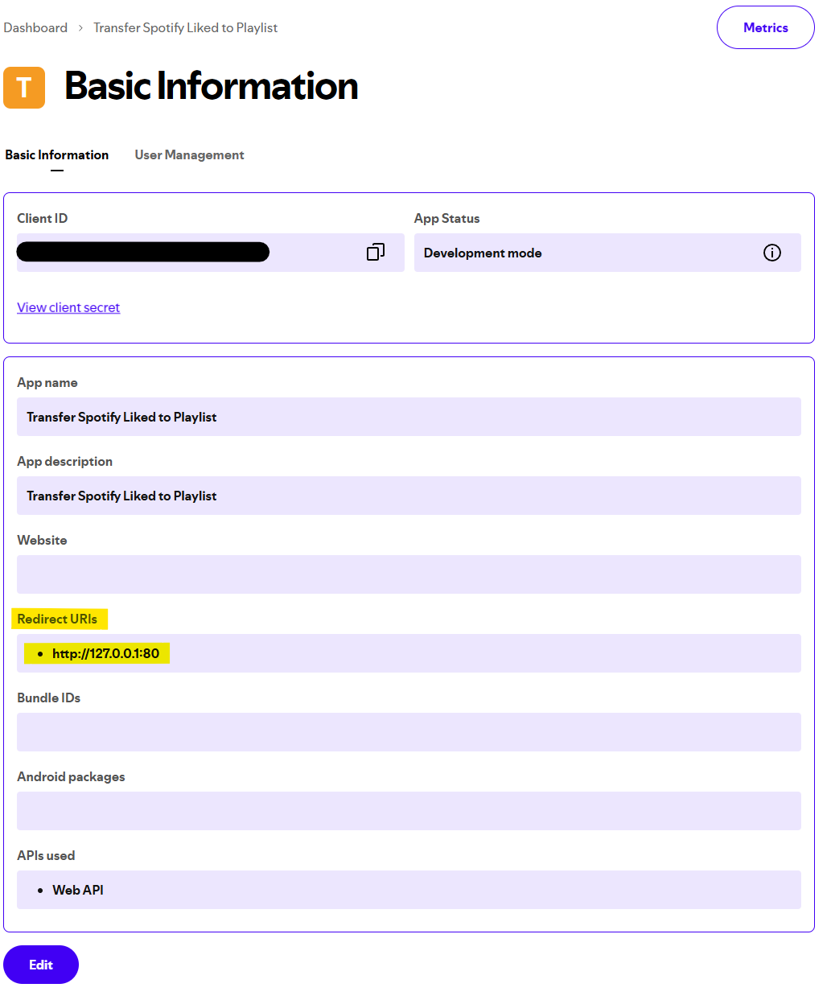

# Spotify Liked Transfer

This is a fork of [Spotify Liked Transfer](https://github.com/rumblefrog/spotify-liked-transfer), which
no longer works, probably due to changes in the Spotify API. Idk though, this is the first time I've
used the Spotify API.

## Usage

1. Rename `.env.example` to `.env`
2. Edit `.env`
    1. `USER_ID` can be obtained on your profile, under the username section usually 
    2. `CLIENT_ID` and `CLIENT_SECRET` requires you to register a developer application at https://developer.spotify.com/dashboard/applications
        1. In addition to copying `CLIENT_ID` and `CLIENT_SECRET` after creating the application, you need to ensure to add `http://127.0.0.1:80` as a redirect URL 
4. After filling out `.env`, execute the binary (.exe, etc) using the command line in the same directory as the `.env` file
4. The application will open your browser and ask you to authenticate through Spotify
5. Copy the _full_ URL you are redirected to (`http://127.0.0.1/...`) and paste it into the application to complete the authorization
6. The application will start moving your liked songs to a playlist under `Liked`
